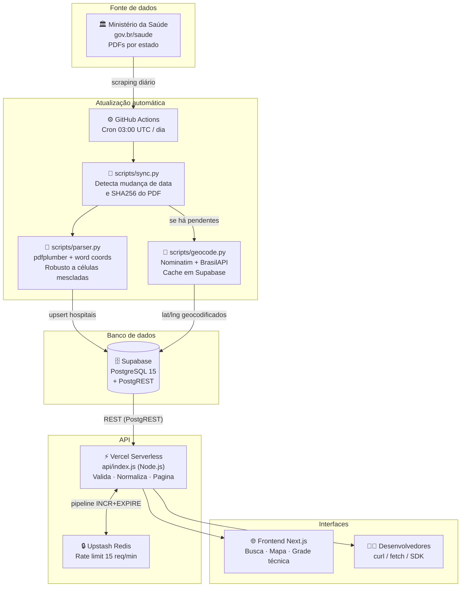
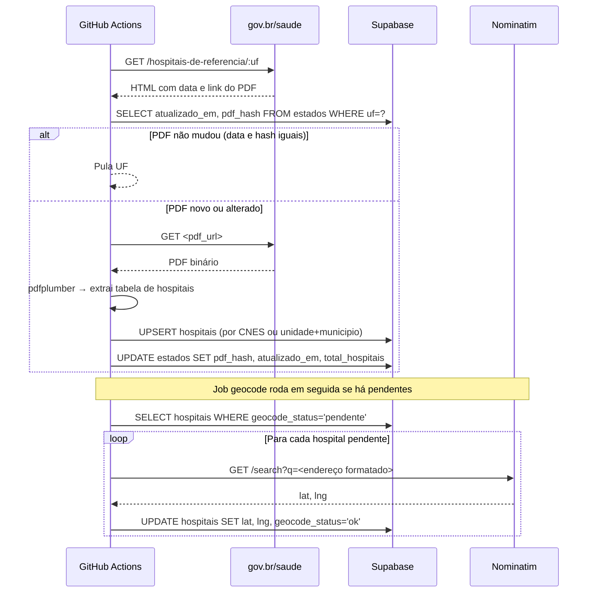
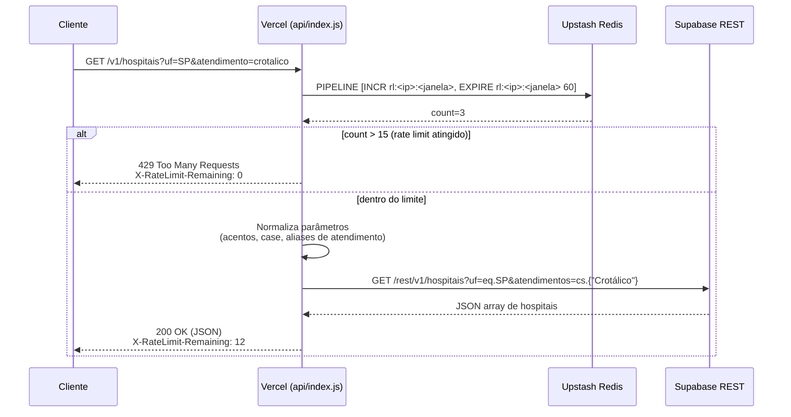
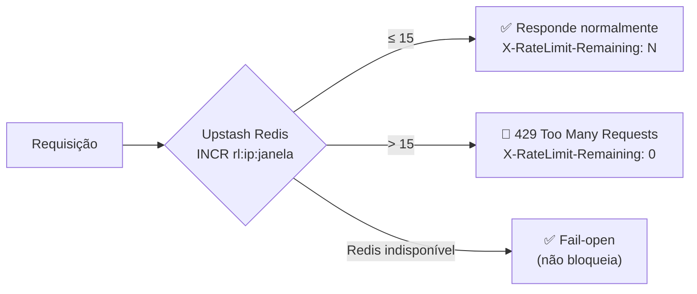
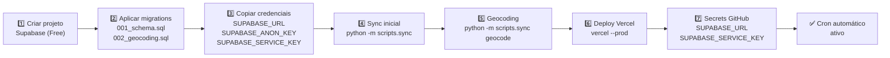

# 🏥 Hospitais de Referência — API & Frontend

> API pública e gratuita com os **hospitais de referência para acidentes por animais peçonhentos no Brasil**, extraídos dos PDFs oficiais do Ministério da Saúde e servidos em JSON estruturado.

[](https://github.com/Codar-Sistemas/hospitais-referencia-api/actions/workflows/sync.yml)


---

### 🔗 Acesso rápido

- **🌐 Site:** https://hospitais-referencia-web.vercel.app
- **📡 API:** https://hospitais-referencia-api.vercel.app/v1/estados
- **💻 Código:** https://github.com/Codar-Sistemas/hospitais-referencia-api

---

> ⚠️ **Em caso de emergência, ligue para o SAMU: 192.** Esta API é uma ferramenta de referência — as informações podem estar desatualizadas em relação à realidade no momento do atendimento.

---

## O que é

Este projeto agrega, normaliza e publica em formato de API REST os dados oficiais dos **hospitais habilitados a tratar acidentes com animais peçonhentos** (cobras, escorpiões, aranhas, lagartas etc.) no Brasil. Os dados vêm de PDFs publicados pelo Ministério da Saúde, atualizados automaticamente todo dia.

**Interfaces disponíveis:**
- **API REST** — para integração em sistemas, apps e pesquisa
- **Frontend web** — busca por estado, município, CEP ou coordenadas, com mapa interativo
- **Visão profissional** — tabela técnica com CNES, grade completa de soros e busca avançada

---

## Arquitetura geral



---

## Fluxo de sincronização (diário)



---

## Fluxo de uma requisição à API



---

## Endpoints

**Base URL:** `https://hospitais-referencia-web.vercel.app`

| | |
|---|---|
| **Rate limit** | 15 req / min por IP |
| **Autenticação** | Nenhuma |
| **CORS** | Liberado (`*`) |
| **Formato** | JSON (`Content-Type: application/json`) |

---

### Estados

#### `GET /v1/estados`

Lista as 27 UFs com data de atualização e total de hospitais.

```bash
curl https://hospitais-referencia-web.vercel.app/v1/estados
```

```json
[
  {
    "uf": "SP",
    "nome": "São Paulo",
    "atualizado_em": "2025-03-10T00:00:00Z",
    "sincronizado_em": "2025-03-11T03:12:00Z",
    "total_hospitais": 87,
    "status": "ok"
  }
]
```

#### `GET /v1/estados/:uf`

Detalhes de uma UF específica.

```bash
curl https://hospitais-referencia-web.vercel.app/v1/estados/SP
```

---

### Hospitais

#### `GET /v1/hospitais`

Busca de hospitais com filtros combinados.

| Parâmetro | Tipo | Descrição |
|---|---|---|
| `uf` | string | Sigla do estado (ex: `SP`) |
| `municipio` | string | Nome do município (accent-insensitive, parcial) |
| `atendimento` | string | Tipo de soro — ver tabela abaixo |
| `q` | string | Full-text em unidade + endereço |
| `limit` | int | Máx 500, padrão 100 |
| `offset` | int | Paginação |

**Tipos de atendimento aceitos** (case e accent-insensitive):

| Parâmetro | Animal / Soro |
|---|---|
| `botropico` | Jararaca, urutu e espécies do gênero *Bothrops* |
| `crotalico` | Cascavel (*Crotalus*) |
| `elapidico` | Coral-verdadeira (*Micrurus*) |
| `laquetico` | Surucucu (*Lachesis*) |
| `escorpionico` | Escorpiões (*Tityus*) |
| `loxoscelico` | Aranha marrom (*Loxosceles*) |
| `foneutrico` | Aranha armadeira (*Phoneutria*) |
| `lonomico` | Lagarta-de-fogo (*Lonomia*) |

```bash
# Hospitais com soro antibotrópico em SP
curl "https://hospitais-referencia-web.vercel.app/v1/hospitais?uf=SP&atendimento=botropico"

# Busca por município (aceita sem acento)
curl "https://hospitais-referencia-web.vercel.app/v1/hospitais?municipio=jundiai"

# Full-text em nome do hospital
curl "https://hospitais-referencia-web.vercel.app/v1/hospitais?q=santa+casa&uf=SP"

# Paginação
curl "https://hospitais-referencia-web.vercel.app/v1/hospitais?uf=MG&limit=20&offset=40"
```

**Resposta:**
```json
[
  {
    "id": 42,
    "uf": "SP",
    "municipio": "Botucatu",
    "unidade": "Hospital das Clínicas da Faculdade de Medicina de Botucatu",
    "endereco": "Avenida Prof. Mario Rubens Guimarães Montenegro, s/n - UNESP",
    "telefones": "(14) 3811-6129",
    "cnes": "2078187",
    "atendimentos": ["Botrópico", "Crotálico", "Elapídico", "Laquético", "Escorpiônico", "Loxoscélico"],
    "lat": -22.894,
    "lng": -48.443
  }
]
```

#### `GET /v1/hospitais/:id`

Hospital específico por ID numérico.

```bash
curl https://hospitais-referencia-web.vercel.app/v1/hospitais/42
```

---

### Busca por proximidade

#### `GET /v1/hospitais/proximos`

Retorna hospitais ordenados por distância a partir de um ponto de origem.

| Parâmetro | Tipo | Descrição |
|---|---|---|
| `cep` | string | CEP brasileiro (8 dígitos, com ou sem hífen) |
| `lat` + `lng` | float | Coordenadas geográficas diretamente |
| `cidade` + `uf` | string | Fallback por nome de cidade (sem distância) |
| `raio` | int | Raio de busca em metros (padrão: 50.000, máx: 200.000) |
| `atendimento` | string | Filtro por tipo de soro |
| `limit` | int | Máx 200, padrão 50 |

```bash
# Por CEP — retorna com distância calculada
curl "https://hospitais-referencia-web.vercel.app/v1/hospitais/proximos?cep=18618970&raio=50000&atendimento=laquetico"

# Por coordenadas — ex: centro de São Paulo
curl "https://hospitais-referencia-web.vercel.app/v1/hospitais/proximos?lat=-23.55&lng=-46.63&raio=100000"

# Por nome de cidade (fallback sem distância)
curl "https://hospitais-referencia-web.vercel.app/v1/hospitais/proximos?cidade=Campinas&uf=SP"
```

**Resposta:**
```json
{
  "origem": {
    "lat": -22.889,
    "lng": -48.445,
    "fonte": "cep",
    "cep": {
      "cep": "18618970",
      "cidade": "Botucatu",
      "uf": "SP"
    }
  },
  "raio_m": 50000,
  "total_retornados": 3,
  "hospitais": [
    {
      "id": 42,
      "municipio": "Botucatu",
      "unidade": "Hospital das Clínicas da Faculdade de Medicina de Botucatu",
      "telefones": "(14) 3811-6129",
      "atendimentos": ["Botrópico", "Crotálico", "Laquético"],
      "lat": -22.894,
      "lng": -48.443,
      "distancia_m": 612.4,
      "distancia_km": 0.6
    }
  ]
}
```

> **CEP cacheado**: a primeira consulta por CEP chama a BrasilAPI para resolver as coordenadas. O resultado é salvo no Supabase (`cep_cache`) — requisições subsequentes ao mesmo CEP são servidas do cache sem nenhuma chamada externa.

---

## Rate limiting



- Janela deslizante de **60 segundos** por IP
- **15 requisições por minuto** — suficiente para uso humano, impede varreduras automatizadas
- Headers de controle em toda resposta:
  - `X-RateLimit-Limit: 15`
  - `X-RateLimit-Remaining: N`
  - `X-RateLimit-Reset: <epoch>`

Se você é um desenvolvedor construindo uma aplicação que precisará de mais volume, considere manter um cache local dos dados ou [abrir uma issue](../../issues) para conversarmos sobre seu caso de uso.

---

## Estrutura do projeto

```
hospitais-referencia-api/
│
├── api/
│   └── index.js              # Serverless handler Vercel (todos os endpoints)
│                             # Rate limit, normalização, proxy para Supabase
│
├── scripts/
│   ├── sync.py               # Scraper gov.br + upsert Supabase + detecção de mudança
│   ├── parser.py             # Extração de PDF (pdfplumber, word-level coordinates)
│   ├── geocode.py            # Nominatim + BrasilAPI, cache em cep_cache
│   └── local_jwt.py          # Gera tokens JWT para dev local
│
├── sql/
│   ├── 001_schema.sql        # Tabelas, índices, RLS, seed dos 27 estados
│   └── 002_geocoding.sql     # Extensões earthdistance, lat/lng, RPC hospitais_proximos
│
├── web/                      # Frontend Next.js 16 + Tailwind
│   ├── app/
│   │   ├── page.tsx          # Busca pública (animal, CEP, cidade) + mapa
│   │   ├── profissionais/    # Visão técnica: CNES, grade de soros
│   │   └── docs/             # Documentação interativa da API
│   ├── components/
│   │   ├── HospitalCard.tsx  # Card com badges de atendimento
│   │   ├── HospitalMap.tsx   # Mapa Leaflet com marcadores
│   │   └── Navbar.tsx        # Navegação + badge SAMU 192
│   └── lib/
│       └── api.ts            # Cliente tipado para a API
│
├── tests/
│   ├── test_parser.py        # Smoke test do parser contra PDF real
│   ├── test_atendimentos.py  # Casos unitários de normalize_atendimentos
│   └── test_geocode.py       # Limpeza de endereço, cache, CEP inválido
│
├── .github/workflows/
│   └── sync.yml              # Cron 03:00 UTC: job sync → job geocode (condicional)
│
├── docker-compose.yml        # Stack local: Postgres + PostgREST + API Node
├── vercel.json               # Roteamento: /v1/* → api/index.js
├── requirements.txt          # Dependências Python
└── .env.example              # Variáveis necessárias para produção
```

---

## Setup

### Rodando localmente com Docker

A stack inteira — banco, REST e API — sobe em containers. Sem conta em nenhum serviço externo.

```bash
# Sobe Postgres 16 + PostgREST + API Node
docker compose up -d

# Testa
curl http://localhost:3000/v1/estados       # via API Node
curl http://localhost:3001/estados          # PostgREST direto (debug)
```

Para popular o banco:

```bash
python -m venv .venv && source .venv/bin/activate
pip install -r requirements.txt

cp .env.local.example .env.local
export $(cat .env.local | xargs)

python -m scripts.sync SP            # sync de um estado
python -m scripts.sync geocode SP    # geocoding desse estado
```

### Deploy em produção (Supabase + Vercel)



#### 1. Supabase

1. Crie um projeto em <https://supabase.com> (plano Free).
2. No SQL Editor, execute em ordem:
   - `sql/001_schema.sql`
   - `sql/002_geocoding.sql`
3. Em *Project Settings → API*, copie as três chaves.

#### 2. Primeira sincronização

```bash
cp .env.example .env
# Preencha SUPABASE_URL e SUPABASE_SERVICE_KEY

export $(cat .env | xargs)

python -m scripts.sync SP        # teste com um estado
python -m scripts.sync           # todos os 27 estados (~5 min)
python -m scripts.sync geocode   # geocodifica hospitais (~1s/hospital)
```

#### 3. Deploy da API

```bash
npm i -g vercel
vercel env add SUPABASE_URL production
vercel env add SUPABASE_ANON_KEY production
vercel env add SUPABASE_SERVICE_KEY production
vercel env add UPSTASH_REDIS_REST_URL production
vercel env add UPSTASH_REDIS_REST_TOKEN production
vercel --prod
```

#### 4. Cron automático (GitHub Actions)

Em *Settings → Secrets and variables → Actions*, adicione:

| Secret | Descrição |
|---|---|
| `SUPABASE_URL` | URL do projeto Supabase |
| `SUPABASE_SERVICE_KEY` | service_role key (escreve no banco) |

O workflow `.github/workflows/sync.yml` roda às **03:00 UTC** (~00:00 horário de Brasília).  
Você também pode disparar manualmente em *Actions → sync-hospitais → Run workflow* com opções:
- `uf`: processar apenas um estado
- `force`: ignorar verificação de mudança e reprocessar mesmo assim
- `skip_geocode`: pular etapa de geocoding

---

## Variações de formato entre estados

O sync lida automaticamente com inconsistências nas publicações do Ministério da Saúde:

| Variação | Como é tratada |
|---|---|
| URL do PDF como `.pdf` direto | Detectado pelo scraper (padrão) |
| URL no formato Plone `/@@download/file` (ex: MG) | Detectado pelo scraper |
| **Pernambuco publica XLSX** em vez de PDF | `status='nao_suportado'` — segue sem erro |
| `"Botrópico-Crotálico"` composto (ex: MG) | Expandido para ambos individualmente |
| Número de colunas diferente entre estados | Parser usa linhas verticais do PDF, não posições fixas |

---

## Custos e limites do free tier

| Serviço | Limite gratuito | Uso estimado |
|---|---|---|
| **Supabase** | 500 MB banco, 5 GB egress/mês | ~3 MB banco |
| **Vercel Hobby** | 100 GB bandwidth/mês, 100k invocações/dia | Conforme tráfego |
| **GitHub Actions** | Ilimitado em repos públicos | ~5 min/dia |
| **Upstash Redis** | 10.000 req/dia no Free | ~req de rate limit |

Custo total: **R$ 0/mês**. O único risco no Supabase Free é pausar após 7 dias sem atividade — o sync diário garante que isso nunca aconteça.

---

## Fonte dos dados e disclaimer legal

Os dados pertencem ao **Ministério da Saúde do Brasil** e são publicados em:  
<https://www.gov.br/saude/pt-br/assuntos/saude-de-a-a-z/a/animais-peconhentos/hospitais-de-referencia>

Este projeto apenas redistribui em formato estruturado e de fácil acesso. Nenhum dado é inventado ou modificado — apenas normalizado (maiúsculas, acentos, tipagem de array).

**⚠️ Esta API é uma ferramenta de referência. Em caso de acidente com animal peçonhento, ligue para o SAMU (192) imediatamente e procure o hospital mais próximo. As informações aqui podem estar desatualizadas.**

---

## Contribuindo

Contribuições são bem-vindas! Veja como:

1. **Issues**: abra uma issue descrevendo o bug ou sugestão
2. **Pull Requests**: todos os PRs precisam de aprovação antes do merge
3. **Dados incorretos**: se encontrar um hospital com dados errados, abra uma issue — pode ser um problema no PDF original do Ministério da Saúde

### Rodando os testes

```bash
pip install -r requirements.txt
pytest tests/ -v
```

