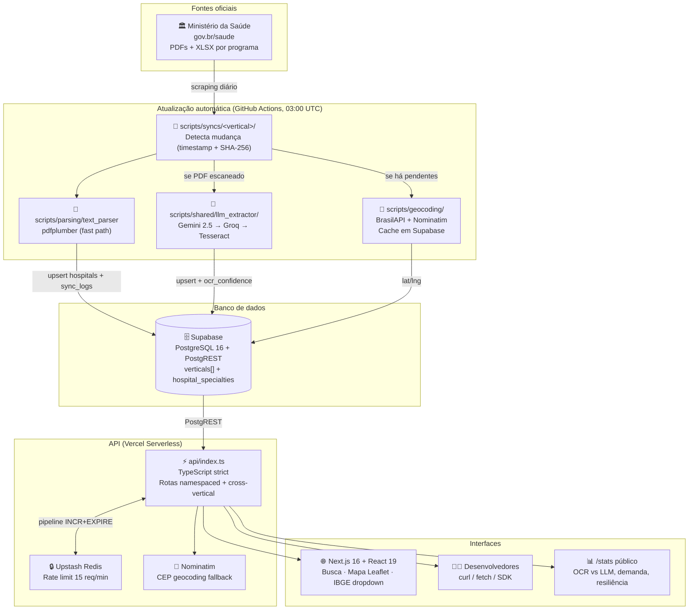
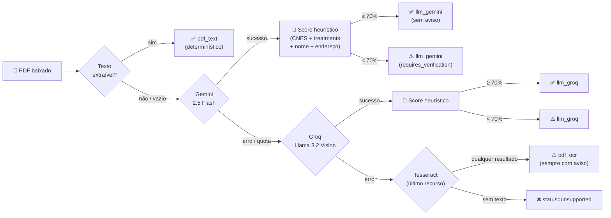
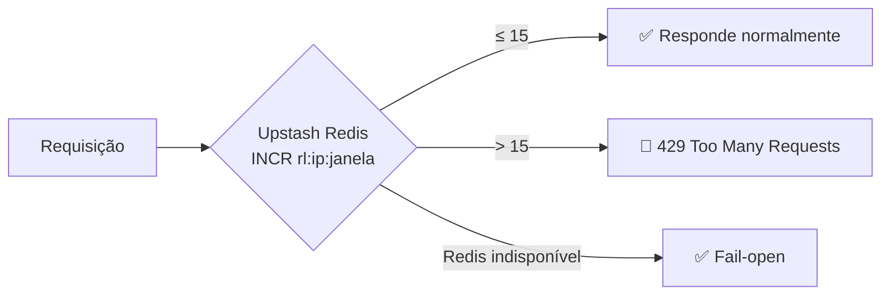
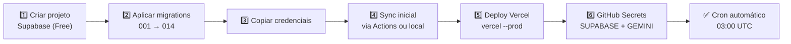

# 🏥 MapaSUS — Hospitais de Referência do SUS

> Plataforma pública e gratuita que organiza, normaliza e republica dados oficiais do **Ministério da Saúde** sobre os hospitais habilitados pelo SUS. A primeira vertical em produção cobre **acidentes por animais peçonhentos** (cobras, escorpiões, aranhas, lagartas). Próximas verticais: doenças raras, oncologia, transplantes.

[](https://github.com/Codar-Sistemas/hospitais-referencia-api/actions/workflows/sync.yml)
[](https://github.com/Codar-Sistemas/hospitais-referencia-api/actions/workflows/lint.yml)
[](https://github.com/Codar-Sistemas/hospitais-referencia-api/actions/workflows/tests.yml)


[](https://orcid.org/0009-0007-7751-0526)
[](https://doi.org/10.5281/zenodo.20633644)

---

### 🔗 Acesso rápido

- **🌐 Site:** https://hospitais-referencia-web.vercel.app
- **📡 API:** https://hospitais-referencia-api.vercel.app
- **📊 Estatísticas públicas:** https://hospitais-referencia-web.vercel.app/stats

---

> ⚠️ **Em caso de emergência, ligue para o SAMU: 192.** Esta API é uma ferramenta de referência — as informações podem estar desatualizadas em relação à realidade no momento do atendimento.

---

## O que é

O Ministério da Saúde publica em `gov.br/saude` listas de hospitais habilitados por programa de atendimento, mas em formatos pouco amigáveis a software (PDFs, XLSX dispersos por estado, sem busca, sem geolocalização). O **MapaSUS** preenche essa lacuna: faz scrape diário desses documentos, extrai os dados, geocodifica os endereços e publica tudo via REST com busca por proximidade.

**Interfaces disponíveis:**

- **API REST** — para integração em sistemas, apps e pesquisa
- **Frontend web** — busca por cidade, CEP ou animal+estado, com mapa interativo
- **Visão profissional** — tabela técnica com CNES, grade completa de soros, mapa e link direto pro Google Maps
- **Página de estatísticas** — métricas públicas anônimas de uso (LGPD-compliant)

## Verticais ativas e roadmap

| Vertical                               | Status                | Fonte oficial                                               |
| -------------------------------------- | --------------------- | ----------------------------------------------------------- |
| **Animais peçonhentos**                | ✅ Em produção        | 27 PDFs estaduais em `gov.br/saude/.../animais-peconhentos` |
| **Doenças raras**                      | 🚧 Em desenvolvimento | 2 XLSX nacionais em `gov.br/saude/.../doencas-raras`        |
| **Oncologia** (alta complexidade)      | 📋 Planejado          | 3 XLSX nacionais em `gov.br/saude/.../cgcan`                |
| Transplantes, Farmácia Popular, CER, … | 🗺️ Roadmap            | gov.br + sites estaduais                                    |

Cada vertical é independente: tem seu próprio sync, prompt de extração, rotas namespaced (`/v1/{vertical}/hospitals`) e cache no banco. Todas compartilham infraestrutura (DB, geocoding, LLM extractor, rate-limit).

---

## Arquitetura geral


```mermaid
graph TB
    subgraph "Fontes oficiais"
        MS["🏛️ Ministério da Saúde<br/>gov.br/saude<br/>PDFs + XLSX por programa"]
    end

    subgraph "Atualização automática (GitHub Actions, 03:00 UTC)"
        SYNC["🐍 scripts/syncs/&lt;vertical&gt;/<br/>Detecta mudança (timestamp + SHA-256)"]
        TEXT["📄 scripts/parsing/text_parser<br/>pdfplumber (fast path)"]
        LLM["🧠 scripts/shared/llm_extractor/<br/>Gemini 2.5 → Groq → Tesseract"]
        GEO["📍 scripts/geocoding/<br/>BrasilAPI + Nominatim<br/>Cache em Supabase"]
    end

    subgraph "Banco de dados"
        SB[("🗄️ Supabase<br/>PostgreSQL 16 + PostgREST<br/>verticals[] + hospital_specialties")]
    end

    subgraph "API (Vercel Serverless)"
        VR["⚡ api/index.ts<br/>TypeScript strict<br/>Rotas namespaced + cross-vertical"]
        RL["🔒 Upstash Redis<br/>Rate limit 15 req/min"]
        NOM["📍 Nominatim<br/>CEP geocoding fallback"]
    end

    subgraph "Interfaces"
        WEB["🌐 Next.js 16 + React 19<br/>Busca · Mapa Leaflet · IBGE dropdown"]
        DEV["👨‍💻 Desenvolvedores<br/>curl / fetch / SDK"]
        STATS["📊 /stats público<br/>OCR vs LLM, demanda, resiliência"]
    end

    MS -->|"scraping diário"| SYNC
    SYNC --> TEXT
    SYNC -->|"se PDF escaneado"| LLM
    TEXT -->|"upsert hospitals + sync_logs"| SB
    LLM -->|"upsert + ocr_confidence"| SB
    SYNC -->|"se há pendentes"| GEO
    GEO -->|"lat/lng"| SB

    SB -->|"PostgREST"| VR
    VR --> NOM
    VR <-->|"pipeline INCR+EXPIRE"| RL
    VR --> WEB
    VR --> DEV
    VR --> STATS
```

---

## Pipeline de extração

O sync tenta cada estratégia na ordem; só desce pra próxima se a anterior falhar. Em produção, **o objetivo é não cair em Tesseract** — a acurácia em tabelas escaneadas em português é cerca de 75%, contra ~98% do LLM.


```mermaid
graph LR
    PDF["📄 PDF baixado"] --> TEXT{"Texto<br/>extraível?"}
    TEXT -->|"sim"| OK1["✅ pdf_text<br/>(determinístico)"]
    TEXT -->|"não / vazio"| GEMINI{"Gemini<br/>2.5 Flash"}
    GEMINI -->|"sucesso"| SCORE["📐 Score heurístico<br/>(CNES + treatments<br/>+ nome + endereço)"]
    SCORE -->|"≥ 70%"| OK2["✅ llm_gemini<br/>(sem aviso)"]
    SCORE -->|"&lt; 70%"| WARN1["⚠️ llm_gemini<br/>(requires_verification)"]
    GEMINI -->|"erro / quota"| GROQ{"Groq<br/>Llama 3.2 Vision"}
    GROQ -->|"sucesso"| SCORE2["📐 Score heurístico"]
    SCORE2 -->|"≥ 70%"| OK3["✅ llm_groq"]
    SCORE2 -->|"&lt; 70%"| WARN2["⚠️ llm_groq"]
    GROQ -->|"erro"| TESS{"Tesseract<br/>(último recurso)"}
    TESS -->|"qualquer resultado"| WARN3["⚠️ pdf_ocr<br/>(sempre com aviso)"]
    TESS -->|"sem texto"| FAIL["❌ status=unsupported"]
```

### Regra do badge "verificação manual"

| `extraction_source`      | Confidence | Badge na UI                |
| ------------------------ | ---------- | -------------------------- |
| `pdf_text`               | n/a        | ✅ Nenhum (determinístico) |
| `llm_gemini`, `llm_groq` | ≥ 70%      | ✅ Nenhum                  |
| `llm_gemini`, `llm_groq` | < 70%      | ⚠️ Recomenda verificação   |
| `pdf_ocr` (Tesseract)    | qualquer   | ⚠️ Sempre (OCR é ruidoso)  |

A regra vive numa coluna `requires_verification BOOLEAN GENERATED ALWAYS AS (...)` em `hospitals` — calculada no banco, indexada parcialmente. Veja `sql/013_extraction_confidence.sql`.

### Score heurístico de confiança (LLM)

Vision-LLMs não expõem logprobs por token (ao contrário do Tesseract). O score é calculado a partir de sinais estruturais por linha extraída:

| Sinal                   | Peso | Como é avaliado                                           |
| ----------------------- | ---- | --------------------------------------------------------- |
| CNES bem-formado        | 30%  | regex `^\d{7}$` (CNES é por especificação 7 dígitos)      |
| Treatments reconhecidos | 30%  | normalizador mapeia para o vocabulário canônico em inglês |
| Nome presente           | 25%  | não-vazio                                                 |
| Endereço presente       | 15%  | não-vazio                                                 |

Implementação em [`scripts/shared/llm_extractor/metrics.py`](scripts/shared/llm_extractor/metrics.py).

---

## Endpoints

**Base URL:** `https://hospitais-referencia-api.vercel.app`

|                  |                                         |
| ---------------- | --------------------------------------- |
| **Rate limit**   | 15 req / min por IP                     |
| **Autenticação** | Nenhuma                                 |
| **CORS**         | Liberado (`*`)                          |
| **Formato**      | JSON (`Content-Type: application/json`) |
| **Idioma**       | Identificadores em inglês               |

> **Compatibilidade**: aliases antigos em português (`uf`, `municipio`, `atendimento`, `raio`) continuam funcionando até **2026-08-24** com headers `Deprecation: true` e `Sunset: <data>`.

### Três formatos de rota

```
# Legado — vertical implícita (animais peçonhentos)
GET /v1/hospitals?state_code=SP

# Namespaced — vertical explícita (preferida)
GET /v1/venomous-animals/hospitals?state_code=SP
GET /v1/doencas-raras/hospitals?state_code=SP            (em breve)

# Cross-vertical — busca em todas as verticais ativas
GET /v1/search?state_code=SP
```

Convenção: URLs usam **kebab-case** (`/v1/venomous-animals`), DB e Python module em **snake_case** (`venomous_animals`). O roteador em `api/index.ts` faz a conversão num único lugar.

### Estados

#### `GET /v1/states`

Lista as 27 UFs com data de atualização e total de hospitais (vertical default = animais peçonhentos).

```bash
curl https://hospitais-referencia-api.vercel.app/v1/states
```

```json
{
  "states": [
    {
      "state_code": "SP",
      "name": "São Paulo",
      "updated_at": "2026-03-10T00:00:00Z",
      "synced_at": "2026-03-11T03:12:00Z",
      "total_hospitals": 245,
      "status": "ok",
      "requires_verification": false
    }
  ]
}
```

#### `GET /v1/states/:state_code`

Detalhes de uma UF específica.

### Hospitais

#### `GET /v1/hospitals` · `GET /v1/{vertical}/hospitals`

Busca de hospitais com filtros combinados.

| Parâmetro    | Tipo   | Descrição                                       |
| ------------ | ------ | ----------------------------------------------- |
| `state_code` | string | Sigla do estado (ex: `SP`)                      |
| `city`       | string | Nome do município (accent-insensitive, parcial) |
| `treatment`  | string | Tipo de soro — ver tabela abaixo                |
| `q`          | string | Full-text em nome + endereço                    |
| `limit`      | int    | Máx 500, padrão 100                             |
| `offset`     | int    | Paginação                                       |

**Tipos de soro aceitos** (input case e accent-insensitive; aceita PT ou EN):

| Valor canônico (EN) | Aliases aceitos no input                | Animal / Soro                                   |
| ------------------- | --------------------------------------- | ----------------------------------------------- |
| `Bothropic`         | `botropico`, `jararaca`, `bothrops`     | Jararaca, urutu e espécies do gênero _Bothrops_ |
| `Crotalic`          | `crotalico`, `cascavel`, `crotalus`     | Cascavel (_Crotalus_)                           |
| `Elapidic`          | `elapidico`, `coral`, `micrurus`        | Coral-verdadeira (_Micrurus_)                   |
| `Lachetic`          | `laquetico`, `surucucu`, `lachesis`     | Surucucu (_Lachesis_)                           |
| `Scorpionic`        | `escorpionico`, `escorpiao`, `tityus`   | Escorpiões (_Tityus_)                           |
| `Loxoscelic`        | `loxoscelico`, `aranha`, `loxosceles`   | Aranha marrom (_Loxosceles_)                    |
| `Phoneutric`        | `foneutrico`, `armadeira`, `phoneutria` | Aranha armadeira (_Phoneutria_)                 |
| `Lonomic`           | `lonomico`, `lagarta`, `lonomia`        | Lagarta-de-fogo (_Lonomia_)                     |
| `Antiarachnidic`    | `antiaracnidico`                        | Antiveneno aracnídico polivalente               |

```bash
# Hospitais com soro antibotrópico em SP — rota legada
curl "https://hospitais-referencia-api.vercel.app/v1/hospitals?state_code=SP&treatment=Bothropic"

# Mesma busca via rota namespaced
curl "https://hospitais-referencia-api.vercel.app/v1/venomous-animals/hospitals?state_code=SP&treatment=Bothropic"

# Aceita também alias PT
curl "https://hospitais-referencia-api.vercel.app/v1/hospitals?state_code=SP&treatment=jararaca"

# Busca por município (sem acento)
curl "https://hospitais-referencia-api.vercel.app/v1/hospitals?city=jundiai"

# Full-text em nome do hospital
curl "https://hospitais-referencia-api.vercel.app/v1/hospitals?q=santa+casa&state_code=SP"

# Paginação
curl "https://hospitais-referencia-api.vercel.app/v1/hospitals?state_code=MG&limit=20&offset=40"
```

**Resposta:**

```json
{
  "filters": {
    "state_code": "SP",
    "city": null,
    "treatment": "Bothropic",
    "q": null,
    "limit": 100,
    "offset": 0,
    "vertical": "venomous_animals"
  },
  "total_returned": 1,
  "hospitals": [
    {
      "id": 42,
      "state_code": "SP",
      "city": "Botucatu",
      "name": "Hospital das Clínicas da Faculdade de Medicina de Botucatu",
      "address": "Avenida Prof. Mario Rubens Guimarães Montenegro, s/n - UNESP",
      "phones": "(14) 3811-6129",
      "cnes": "2078187",
      "treatments": ["Bothropic", "Crotalic", "Elapidic", "Lachetic", "Scorpionic", "Loxoscelic"],
      "lat": -22.894,
      "lng": -48.443,
      "extraction_source": "pdf_text",
      "ocr_confidence": null,
      "requires_verification": false,
      "verticals": ["venomous_animals"]
    }
  ]
}
```

#### `GET /v1/hospitals/:id`

Hospital específico por ID numérico.

### Busca por proximidade

#### `GET /v1/hospitals/nearby` · `GET /v1/{vertical}/hospitals/nearby`

Hospitais ordenados por distância a partir de um ponto de origem.

| Parâmetro             | Tipo   | Descrição                                              |
| --------------------- | ------ | ------------------------------------------------------ |
| `cep`                 | string | CEP brasileiro (8 dígitos, com ou sem hífen)           |
| `lat` + `lng`         | float  | Coordenadas geográficas diretamente                    |
| `city` + `state_code` | string | Fallback por nome de cidade (sem distância)            |
| `radius_m`            | int    | Raio de busca em metros (padrão: 50.000, máx: 200.000) |
| `treatment`           | string | Filtro por tipo de soro                                |
| `limit`               | int    | Máx 200, padrão 50                                     |

```bash
# Por CEP — retorna com distância calculada
curl "https://hospitais-referencia-api.vercel.app/v1/hospitals/nearby?cep=18618970&radius_m=50000&treatment=Lachetic"

# Por coordenadas
curl "https://hospitais-referencia-api.vercel.app/v1/hospitals/nearby?lat=-23.55&lng=-46.63&radius_m=100000"

# Por nome de cidade (fallback sem distância)
curl "https://hospitais-referencia-api.vercel.app/v1/hospitals/nearby?city=Campinas&state_code=SP"
```

> **Geocoding em duas camadas**: a primeira consulta por CEP chama a BrasilAPI. Se ela não retornar lat/lng (caso comum), a API automaticamente geocodifica o endereço estruturado via Nominatim, com fallback progressivo (rua → bairro → cidade). O resultado completo é salvo em `cep_cache`.

### Busca cross-vertical

#### `GET /v1/search`

Busca em **todas as verticais simultaneamente**, retornando hospitais com a lista completa de programas SUS em que estão habilitados.

```bash
curl "https://hospitais-referencia-api.vercel.app/v1/search?city=curitiba"
```

```json
{
  "filters": { "vertical": "all", "city": "curitiba", "state_code": null, "q": null },
  "total_returned": 1,
  "hospitals": [
    {
      "name": "Hospital de Clínicas da UFPR",
      "city": "Curitiba",
      "active_verticals": ["venomous_animals", "doencas_raras", "oncology"],
      "active_specialties": ["Bothropic", "Crotalic", "Terapia Gênica AME", "Radioterapia"]
    }
  ]
}
```

Útil pro hub do MapaSUS — uma busca, três bases de dados.

### Estatísticas públicas

#### `GET /v1/stats`

Agregados anônimos. `Cache-Control: public, max-age=300`.

Retorna:

- `overview` — total de buscas (30d), usuários únicos (IP hasheado SHA-256+salt), média de resultados
- `demand_by_user_state` — UFs de onde vêm as buscas (CEP-based)
- `treatment_popularity_30d` — tipos de soro mais buscados
- `search_timeline_30d` — volume diário
- `sync_resilience_90d` — sucesso/falha + **breakdown por método** (`ocr_fallback_runs`, `llm_gemini_runs`, `llm_groq_runs`, `llm_fallback_runs`)
- `coverage_by_state` — total de hospitais, geocoded e contagens por método (`ocr_records`, `llm_records`)

A página pública [`/stats`](https://hospitais-referencia-web.vercel.app/stats) visualiza esses dados.

#### `POST /v1/track`

Endpoint para telemetria do frontend (`search_executed`, `hospital_clicked`, `phone_clicked`, etc.). Body JSON, máx 4KB.

```bash
curl -X POST https://hospitais-referencia-api.vercel.app/v1/track \
  -H "Content-Type: application/json" \
  -d '{"event_type":"search_executed","state_code":"SP","treatment":"Bothropic","session_id":"anon-uuid"}'
```

---

## Rate limiting


```mermaid
graph LR
    REQ["Requisição"] --> CHECK{"Upstash Redis<br/>INCR rl:ip:janela"}
    CHECK -->|"≤ 15"| OK["✅ Responde normalmente"]
    CHECK -->|"> 15"| BLOCK["🚫 429 Too Many Requests"]
    CHECK -->|"Redis indisponível"| PASSTHROUGH["✅ Fail-open"]
```

- Janela deslizante de **60 segundos** por IP, **15 req/min**
- Headers: `X-RateLimit-{Limit, Remaining}`, `X-RateLimit-Window`
- Fail-open: Redis down não derruba a API

---

## Estrutura do projeto

```
hospitais-referencia-api/
│
├── api/
│   └── index.ts                 # Vercel serverless entry (TypeScript strict)
│
├── lib/                         # Backend Node.js, TypeScript strict
│   ├── handlers/                # HTTP: hospitals, states, stats, track, metadata
│   ├── services/                # Lógica: hospital, geocoding, search-normalizer
│   ├── repositories/            # PostgREST: hospital, state, cep
│   ├── middleware/              # cors, rate-limit, metrics
│   ├── core/                    # supabase, redis, http, errors, metrics
│   ├── providers/               # cep (BrasilAPI), nominatim
│   └── types/                   # domain.ts, http.ts (Vertical, Hospital, …)
│
├── scripts/                     # Python 3.12, mypy --strict
│   ├── syncs/                   # Uma pasta por vertical do MapaSUS
│   │   ├── venomous_animals/    # 27 PDFs estaduais (ativo)
│   │   ├── rare_diseases/       # 2 XLSX nacionais (em breve)
│   │   └── oncology/            # 3 XLSX nacionais (planejado)
│   ├── shared/
│   │   ├── llm_extractor/       # Provider chain: Gemini → Groq + schema + score
│   │   │   ├── providers/       # base.py, gemini.py, groq.py
│   │   │   ├── prompts/         # 1 por vertical
│   │   │   ├── schemas/         # Pydantic (validação da resposta)
│   │   │   ├── preprocessing.py # pdf2image + Pillow (resize/sharpen)
│   │   │   ├── pipeline.py      # orquestrador
│   │   │   └── metrics.py       # score heurístico de confiança
│   │   ├── types.py             # TypedDicts (HospitalRecord, StateRow, …)
│   │   ├── db.py                # Cliente Supabase REST
│   │   └── logger.py
│   ├── parsing/                 # text_parser (pdfplumber), ocr_parser/engine (Tesseract)
│   ├── geocoding/               # runner + address_normalizer
│   ├── providers/               # Nominatim, BrasilAPI (Python)
│   ├── dev-server.ts            # Wrapper local da API (tsx)
│   ├── seed-from-prod.ts        # Popula Supabase local a partir da prod
│   └── backup_supabase.py       # Snapshot JSONL antes de migrations
│
├── sql/                         # Migrations idempotentes, executadas em ordem
│   ├── 001 → 008                # Schema base, métricas Phase 1 (sync_logs, web_events)
│   ├── 009_multi_vertical.sql   # verticals[] + hospital_specialties + v_hospitals_all
│   ├── 010_rpc_vertical.sql     # nearby_hospitals() ganha p_vertical
│   ├── 011_rename_*             # Renomeia chave 'peconhentos' → 'animais_peconhentos'
│   ├── 012_rename_*_to_en.sql   # Renomeia para 'venomous_animals' (en final)
│   ├── 013_extraction_confidence.sql        # requires_verification baseado em confidence
│   └── 014_stats_by_extraction_method.sql   # views quebram OCR vs LLM
│
├── web/                         # Frontend Next.js 16 + Tailwind 4 + React 19
│   ├── app/                     # /, /profissionais, /stats, /docs, /termos
│   ├── components/              # ui/Combobox, hospital/HospitalMap, search/SearchTabs, …
│   ├── hooks/useHospitalSearch.ts
│   └── lib/                     # api-client, ibge, telemetry, types
│
├── tests/                       # Smoke + unitários (pytest + assert)
│
├── .github/workflows/
│   ├── sync.yml                 # Cron 03:00 UTC: scrape + parse + LLM + upsert + geocode
│   ├── lint.yml                 # tsc + ESLint + Prettier + Ruff + mypy
│   └── tests.yml                # pytest em mudanças de scripts/ ou tests/
│
├── .husky/pre-commit            # lint-staged + tsc + mypy
├── tsconfig.json                # strict + 5 flags extras (web/ tem o mesmo)
├── pyproject.toml               # Ruff + mypy --strict
├── eslint.config.mjs            # ESLint flat config (api/ + lib/)
├── vercel.json                  # /* → api/index.ts
├── requirements.txt             # Python deps (pdfplumber, google-genai, groq, pydantic, …)
├── AGENTS.md                    # Baseline de tipagem + naming + convenções
├── MAPASUS_MIGRATION.md         # Plano da pivotada para plataforma multi-vertical
└── REFACTORING_MAP.md           # Histórico Phase 0 (PT → EN)
```

---

## Setup

### Pré-requisitos

- **Python 3.12+** (use `uv python install 3.12` se ainda não tem)
- **Node.js 22+**
- **Supabase CLI** (`brew install supabase/tap/supabase`)
- **Docker Desktop** (para rodar Supabase local via CLI)
- **Tesseract + poppler** (somente se quiser testar o fallback Tesseract — `brew install tesseract tesseract-lang poppler`)

### Rodando localmente (Supabase CLI + uv)

```bash
# 1. Subir o stack Supabase local (Postgres + PostgREST + Studio)
supabase start

# 2. Criar venv Python 3.12 + instalar deps
uv venv --python 3.12 .venv
uv pip install --python .venv/bin/python -r requirements.txt mypy types-requests ruff

# 3. Aplicar todas as migrations
for f in sql/00*.sql sql/01*.sql; do
  PGPASSWORD=postgres psql -h 127.0.0.1 -p 54322 -U postgres -d postgres -f "$f"
done

# 4. Copiar credenciais locais
cat > .env.local <<EOF
SUPABASE_URL=http://127.0.0.1:54321
SUPABASE_ANON_KEY=$(supabase status -o env | grep '^ANON_KEY=' | cut -d= -f2 | tr -d '"')
SUPABASE_SERVICE_KEY=$(supabase status -o env | grep '^SERVICE_ROLE_KEY=' | cut -d= -f2 | tr -d '"')
EOF

# 5. (Opcional) populá-lo com dados reais de produção
npx tsx scripts/seed-from-prod.ts SP RJ MG

# 6. Subir a API local + frontend
npm install
npm run dev                            # API em :3001
cd web && npm install && npm run dev   # Frontend em :3000
```

### Variáveis de ambiente

| Variável                   | Onde                           | Quando precisa                               |
| -------------------------- | ------------------------------ | -------------------------------------------- |
| `SUPABASE_URL`             | `.env.local` + GitHub + Vercel | sempre                                       |
| `SUPABASE_ANON_KEY`        | `.env.local` + Vercel          | API (read path)                              |
| `SUPABASE_SERVICE_KEY`     | `.env.local` + GitHub          | sync + writes                                |
| `GEMINI_API_KEY`           | GitHub Actions (secret)        | Extração via Gemini (free tier OK)           |
| `GROQ_API_KEY`             | GitHub Actions (secret)        | Fallback do Gemini (opcional)                |
| `UPSTASH_REDIS_REST_URL`   | Vercel                         | Rate limit (fail-open se omitido)            |
| `UPSTASH_REDIS_REST_TOKEN` | Vercel                         | Idem                                         |
| `METRICS_IP_SALT`          | Vercel                         | Anonimização LGPD (use 32+ chars aleatórios) |
| `NEXT_PUBLIC_API_URL`      | Vercel (projeto web)           | Frontend aponta pra API                      |
| `NEXT_PUBLIC_POSTHOG_KEY`  | Vercel (projeto web)           | Telemetria opcional                          |

### Deploy em produção (Supabase + Vercel + GitHub Actions)


```mermaid
graph LR
    A["1️⃣ Criar projeto<br/>Supabase (Free)"] --> B["2️⃣ Aplicar migrations<br/>001 → 014"]
    B --> C["3️⃣ Copiar credenciais"]
    C --> D["4️⃣ Sync inicial<br/>via Actions ou local"]
    D --> E["5️⃣ Deploy Vercel<br/>vercel --prod"]
    E --> F["6️⃣ GitHub Secrets<br/>SUPABASE + GEMINI"]
    F --> G["✅ Cron automático<br/>03:00 UTC"]
```

#### 1. Supabase

```bash
# Linkar o projeto
supabase link --project-ref <PROJECT_REF>

# Aplicar migrations em ordem
for f in sql/00*.sql sql/01*.sql; do
  supabase db query --linked --file "$f"
done
```

#### 2. Vercel — API + Frontend

```bash
npm i -g vercel
vercel link

# Env vars obrigatórias (API)
vercel env add SUPABASE_URL production
vercel env add SUPABASE_ANON_KEY production
vercel env add SUPABASE_SERVICE_KEY production
vercel env add UPSTASH_REDIS_REST_URL production
vercel env add UPSTASH_REDIS_REST_TOKEN production
vercel env add METRICS_IP_SALT production

vercel --prod

# Frontend
cd web
vercel link
vercel env add NEXT_PUBLIC_API_URL production
vercel --prod
```

> **Nota Vercel Hobby**: o plano gratuito limita a 12 Serverless Functions por deployment. Por isso o código compartilhado mora em `/lib` (fora de `/api`), garantindo apenas 1 function (`api/index.ts`).

#### 3. GitHub Secrets (Actions)

Em _Settings → Environments → production → Environment secrets_, adicione:

| Secret                 | Descrição                                                                 |
| ---------------------- | ------------------------------------------------------------------------- |
| `SUPABASE_URL`         | URL do projeto Supabase                                                   |
| `SUPABASE_ANON_KEY`    | anon key                                                                  |
| `SUPABASE_SERVICE_KEY` | service_role key (escreve no banco)                                       |
| `GEMINI_API_KEY`       | Chave AI Studio em https://aistudio.google.com/apikey (free 1500 req/dia) |
| `GROQ_API_KEY`         | Opcional — fallback. https://console.groq.com (free 14.4k req/dia)        |

O workflow `.github/workflows/sync.yml` roda às **03:00 UTC** (~00:00 horário de Brasília).  
Você pode disparar manualmente em _Actions → sync-hospitals → Run workflow_:

- `state_code`: processar apenas um estado (ou vazio = todos)
- `force`: ignorar verificação de mudança e reprocessar
- `skip_geocoding`: pular etapa de geocoding

---

## Variações de formato entre estados

O sync lida automaticamente com inconsistências nas publicações do Ministério da Saúde:

| Variação                                         | Como é tratada                                                                    |
| ------------------------------------------------ | --------------------------------------------------------------------------------- |
| URL do PDF como `.pdf` direto                    | Detectado pelo scraper (padrão)                                                   |
| URL no formato Plone `/@@download/file` (ex: MG) | Detectado pelo scraper                                                            |
| **Pernambuco publica XLSX** em vez de PDF        | `status='unsupported'` — segue sem erro                                           |
| **PDF escaneado** (ex: Piauí)                    | Pipeline LLM (Gemini → Groq); fallback Tesseract com `requires_verification=true` |
| `"Botrópico-Crotálico"` composto (ex: MG)        | Expandido para ambos individualmente                                              |
| Número de colunas diferente entre estados        | Parser usa linhas verticais do PDF, não posições fixas                            |

---

## Observabilidade

Toda requisição à API é gravada em `api_metrics` (fire-and-forget, IP hasheado SHA-256+salt para LGPD). Eventos do frontend (cliques, buscas, aberturas de mapa) são gravados em `web_events` via `POST /v1/track`.

Cada execução do sync (mesmo as que não fazem nada) é registrada em `sync_logs` com duração, deltas, tipo de erro, `triggered_by` (`cron` / `manual` / `force`) e `extraction_source` — isso permite responder perguntas como:

- "Em quantos dos últimos 90 dias o gov.br ficou inacessível?" → `v_sync_resilience_90d`
- "Quantas extrações foram via LLM vs Tesseract?" → `v_sync_resilience_90d` (campos `llm_fallback_runs`, `ocr_fallback_runs`)
- "De quais UFs vêm as buscas?" → `v_demand_by_user_state`
- "Quais animais são mais procurados?" → `v_treatment_popularity_30d`

As views agregadoras alimentam a página pública [`/stats`](https://hospitais-referencia-web.vercel.app/stats).

---

## Custos e limites do free tier

| Serviço               | Limite gratuito                           | Uso estimado                 |
| --------------------- | ----------------------------------------- | ---------------------------- |
| **Supabase**          | 500 MB banco, 5 GB egress/mês             | ~5 MB banco                  |
| **Vercel Hobby**      | 12 functions/deploy, 100 GB bandwidth/mês | 1 function (api/)            |
| **GitHub Actions**    | Ilimitado em repos públicos               | ~5 min/dia                   |
| **Upstash Redis**     | 10.000 req/dia no Free                    | Rate limit                   |
| **Nominatim**         | 1 req/s (free, OSM)                       | Apenas em CEPs novos         |
| **BrasilAPI**         | Generoso, sem chave                       | ~req por CEP novo            |
| **IBGE Localidades**  | Generoso, sem chave                       | Cliente cacheia              |
| **Gemini 2.5 Flash**  | 1.500 req/dia (AI Studio)                 | ~5–15 req/dia (PDFs mudados) |
| **Groq Llama Vision** | 14.400 req/dia                            | Fallback do Gemini           |
| **PostHog** (opt)     | 1M eventos/mês                            | Tráfego web atual            |

Custo total: **R$ 0/mês**. O único risco no Supabase Free é pausar após 7 dias sem atividade — o sync diário garante que isso nunca aconteça.

---

## Padrões de desenvolvimento

Baseline obrigatória (detalhes em [`AGENTS.md`](AGENTS.md)):

| Camada                      | Tooling                                                                                                                                             |
| --------------------------- | --------------------------------------------------------------------------------------------------------------------------------------------------- |
| Backend (`api`, `lib`)      | TypeScript `strict: true` + `noUncheckedIndexedAccess` + `exactOptionalPropertyTypes` + `noImplicitOverride` + `noPropertyAccessFromIndexSignature` |
| Frontend (`web/`)           | Mesma matriz de flags                                                                                                                               |
| Python (`scripts`, `tests`) | `mypy --strict` + ruff lint/format. Tests com override mais permissivo.                                                                             |
| SQL                         | Migrations idempotentes + `psql -f` local antes do merge                                                                                            |

### Convenção de naming

| Camada                     | Idioma                      | Exemplo                                |
| -------------------------- | --------------------------- | -------------------------------------- |
| DB columns + vertical keys | English, snake_case         | `venomous_animals`, `state_code`       |
| Python modules / folders   | English, snake_case         | `scripts/syncs/venomous_animals/`      |
| TypeScript types / vars    | English, camelCase          | `Vertical`, `verticalFilter`           |
| URL paths                  | English, kebab-case         | `/v1/venomous-animals/hospitals`       |
| User-facing strings (UI)   | Português — nome MS oficial | "Animais Peçonhentos", "Doenças Raras" |

### Pre-commit hook

`husky + lint-staged + tsc + mypy`. Bloqueia o commit em:

- erros TypeScript em api/, lib/, web/
- erros mypy em scripts/, tests/
- ESLint/Prettier não atendidos
- Ruff lint/format não atendidos

CI repete tudo no PR (`.github/workflows/lint.yml`).

### Comentários

Documentar **por quê**, não **o quê**. Comentário só quando:

- Decisão não-óbvia (rate-limit fail-open, LGPD IP-hash, regra do `private` cache-control)
- Edge case real motivou código estranho (geocoding em 3 passos por CEP raro)
- Múltiplos lugares devem mudar juntos (`Vertical` ↔ `KNOWN_VERTICALS` ↔ `URL_TO_DB_VERTICAL`)

---

## Fonte dos dados e disclaimer legal

Os dados pertencem ao **Ministério da Saúde do Brasil**. Para a vertical de animais peçonhentos, são publicados em:  
<https://www.gov.br/saude/pt-br/assuntos/saude-de-a-a-z/a/animais-peconhentos/hospitais-de-referencia>

Este projeto apenas redistribui em formato estruturado e de fácil acesso. Nenhum dado é inventado ou modificado — apenas normalizado (maiúsculas, acentos, tipagem de array, tradução de valores canônicos para inglês para padronização internacional da API).

**MapaSUS é uma iniciativa cidadã independente, mantida pela [Codar Sistemas](https://codarsistemas.com.br). Não tem vínculo institucional com o Ministério da Saúde do Brasil.**

> ⚠️ **Esta API é uma ferramenta de referência. Em caso de acidente com animal peçonhento, ligue para o SAMU (192) imediatamente e procure o hospital mais próximo. As informações aqui podem estar desatualizadas.**

---

## Contribuindo

Contribuições são bem-vindas. Veja como:

1. **Issues**: abra uma issue descrevendo o bug ou sugestão.
2. **Pull Requests**: todos os PRs precisam de CI verde (tsc + ESLint + Prettier + Ruff + mypy + pytest).
3. **Dados incorretos**: se encontrar um hospital com dados errados, abra uma issue — pode ser um problema no PDF original.

### Rodando os testes

```bash
# Python (parser, geocoding, LLM extractor, atendimentos)
.venv/bin/python -m tests.test_atendimentos
.venv/bin/python -m tests.test_geocode
.venv/bin/python -m tests.test_llm_extractor
.venv/bin/python -m tests.test_parser   # requer PDF de SP; skip-friendly

# Type-check completo
npm run typecheck                 # backend
cd web && npx tsc --noEmit        # frontend
.venv/bin/python -m mypy scripts/ tests/

# Lint completo
npm run check
```
