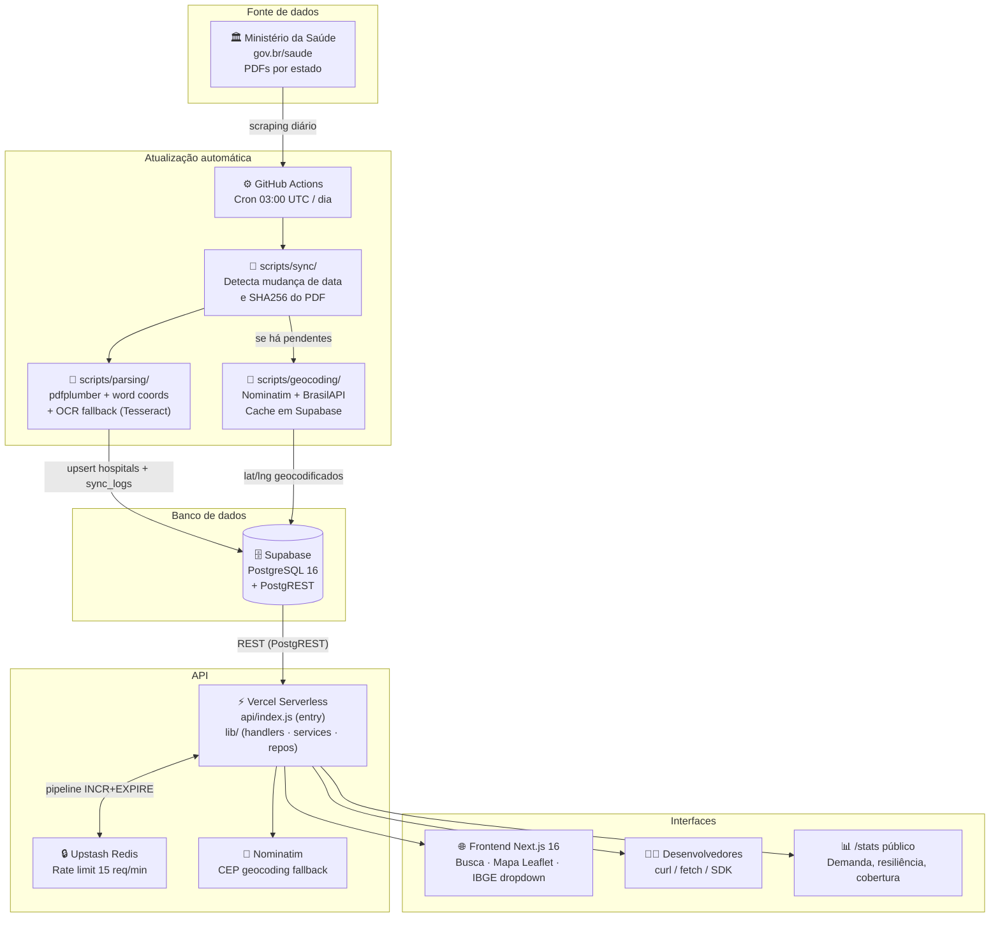
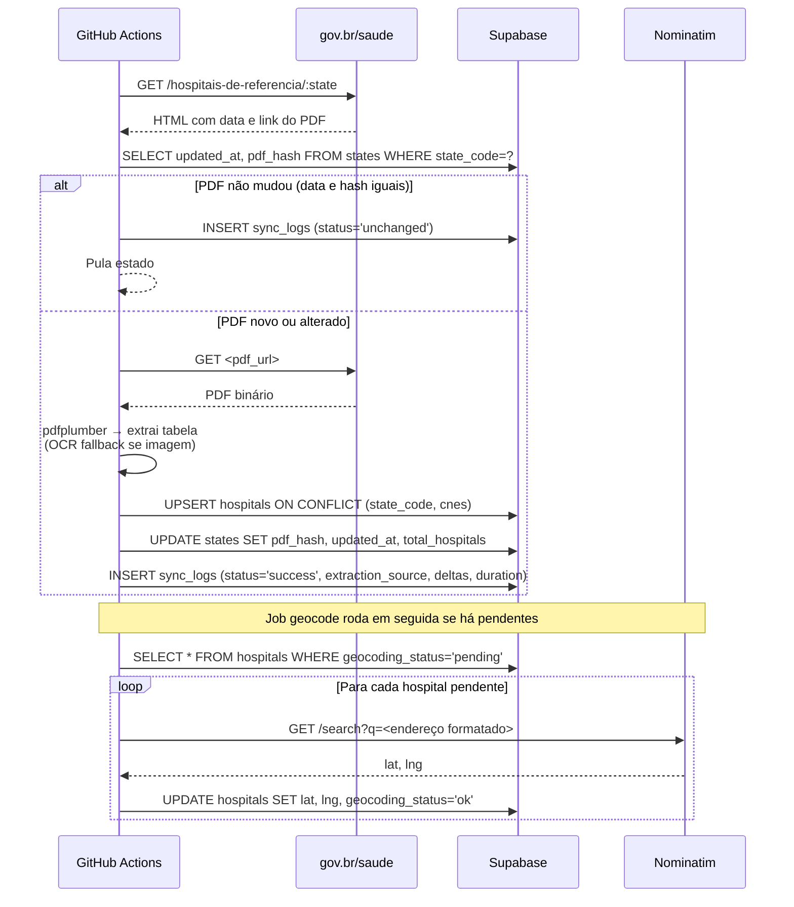
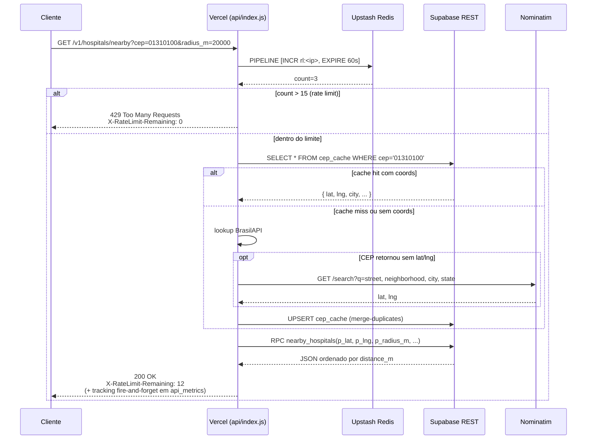
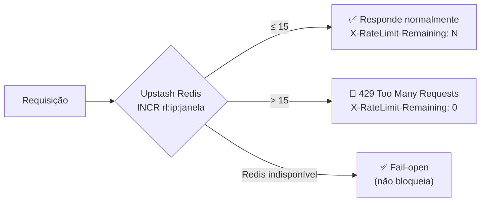
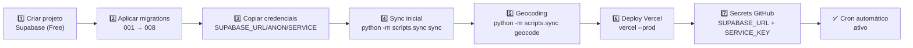

# 🏥 Hospitais de Referência — API & Frontend

> API pública e gratuita com os **hospitais de referência para acidentes por animais peçonhentos no Brasil**, extraídos dos PDFs oficiais do Ministério da Saúde e servidos em JSON estruturado.

[](https://github.com/Codar-Sistemas/hospitais-referencia-api/actions/workflows/sync.yml)
[](https://github.com/Codar-Sistemas/hospitais-referencia-api/actions/workflows/lint.yml)
[](https://github.com/Codar-Sistemas/hospitais-referencia-api/actions/workflows/tests.yml)


---

### 🔗 Acesso rápido

- **🌐 Site:** https://hospitais-referencia-web.vercel.app
- **📡 API:** https://hospitais-referencia-api.vercel.app
- **📊 Estatísticas públicas:** https://hospitais-referencia-web.vercel.app/stats

---

> ⚠️ **Em caso de emergência, ligue para o SAMU: 192.** Esta API é uma ferramenta de referência — as informações podem estar desatualizadas em relação à realidade no momento do atendimento.

---

## O que é

Este projeto agrega, normaliza e publica em formato de API REST os dados oficiais dos **hospitais habilitados a tratar acidentes com animais peçonhentos** (cobras, escorpiões, aranhas, lagartas etc.) no Brasil. Os dados vêm de PDFs publicados pelo Ministério da Saúde, atualizados automaticamente todo dia.

**Interfaces disponíveis:**

- **API REST** — para integração em sistemas, apps e pesquisa
- **Frontend web** — busca por cidade, CEP ou animal+estado, com mapa interativo
- **Visão profissional** — tabela técnica com CNES, grade completa de soros, mapa e link direto pro Google Maps
- **Página de estatísticas** — métricas públicas anônimas de uso (LGPD-compliant)

---

## Arquitetura geral


```mermaid
graph TB
    subgraph "Fonte de dados"
        MS["🏛️ Ministério da Saúde<br/>gov.br/saude<br/>PDFs por estado"]
    end

    subgraph "Atualização automática"
        GHA["⚙️ GitHub Actions<br/>Cron 03:00 UTC / dia"]
        SYNC["🐍 scripts/sync/<br/>Detecta mudança de data<br/>e SHA256 do PDF"]
        PARSER["📄 scripts/parsing/<br/>pdfplumber + word coords<br/>+ OCR fallback (Tesseract)"]
        GEO["📍 scripts/geocoding/<br/>Nominatim + BrasilAPI<br/>Cache em Supabase"]
    end

    subgraph "Banco de dados"
        SB[("🗄️ Supabase<br/>PostgreSQL 16<br/>+ PostgREST")]
    end

    subgraph "API"
        VR["⚡ Vercel Serverless<br/>api/index.js (entry)<br/>lib/ (handlers · services · repos)"]
        RL["🔒 Upstash Redis<br/>Rate limit 15 req/min"]
        NOM["📍 Nominatim<br/>CEP geocoding fallback"]
    end

    subgraph "Interfaces"
        WEB["🌐 Frontend Next.js 16<br/>Busca · Mapa Leaflet · IBGE dropdown"]
        DEV["👨‍💻 Desenvolvedores<br/>curl / fetch / SDK"]
        STATS["📊 /stats público<br/>Demanda, resiliência, cobertura"]
    end

    MS -->|"scraping diário"| GHA
    GHA --> SYNC
    SYNC --> PARSER
    PARSER -->|"upsert hospitals + sync_logs"| SB
    SYNC -->|"se há pendentes"| GEO
    GEO -->|"lat/lng geocodificados"| SB

    SB -->|"REST (PostgREST)"| VR
    VR --> NOM
    VR <-->|"pipeline INCR+EXPIRE"| RL
    VR --> WEB
    VR --> DEV
    VR --> STATS
```

---

## Fluxo de sincronização (diário)


```mermaid
sequenceDiagram
    participant GHA as GitHub Actions
    participant GOV as gov.br/saude
    participant SB as Supabase
    participant NOM as Nominatim

    GHA->>GOV: GET /hospitais-de-referencia/:state
    GOV-->>GHA: HTML com data e link do PDF

    GHA->>SB: SELECT updated_at, pdf_hash FROM states WHERE state_code=?

    alt PDF não mudou (data e hash iguais)
        GHA->>SB: INSERT sync_logs (status='unchanged')
        GHA-->>GHA: Pula estado
    else PDF novo ou alterado
        GHA->>GOV: GET <pdf_url>
        GOV-->>GHA: PDF binário
        GHA->>GHA: pdfplumber → extrai tabela<br/>(OCR fallback se imagem)
        GHA->>SB: UPSERT hospitals ON CONFLICT (state_code, cnes)
        GHA->>SB: UPDATE states SET pdf_hash, updated_at, total_hospitals
        GHA->>SB: INSERT sync_logs (status='success', extraction_source, deltas, duration)
    end

    Note over GHA,NOM: Job geocode roda em seguida se há pendentes
    GHA->>SB: SELECT * FROM hospitals WHERE geocoding_status='pending'
    loop Para cada hospital pendente
        GHA->>NOM: GET /search?q=<endereço formatado>
        NOM-->>GHA: lat, lng
        GHA->>SB: UPDATE hospitals SET lat, lng, geocoding_status='ok'
    end
```

---

## Fluxo de uma requisição à API


```mermaid
sequenceDiagram
    participant CLI as Cliente
    participant VR as Vercel (api/index.js)
    participant UPS as Upstash Redis
    participant SB as Supabase REST
    participant NOM as Nominatim

    CLI->>VR: GET /v1/hospitals/nearby?cep=01310100&radius_m=20000

    VR->>UPS: PIPELINE [INCR rl:<ip>, EXPIRE 60s]
    UPS-->>VR: count=3

    alt count > 15 (rate limit)
        VR-->>CLI: 429 Too Many Requests<br/>X-RateLimit-Remaining: 0
    else dentro do limite
        VR->>SB: SELECT * FROM cep_cache WHERE cep='01310100'
        alt cache hit com coords
            SB-->>VR: { lat, lng, city, ... }
        else cache miss ou sem coords
            VR->>VR: lookup BrasilAPI
            opt CEP retornou sem lat/lng
                VR->>NOM: GET /search?q=street, neighborhood, city, state
                NOM-->>VR: lat, lng
            end
            VR->>SB: UPSERT cep_cache (merge-duplicates)
        end
        VR->>SB: RPC nearby_hospitals(p_lat, p_lng, p_radius_m, ...)
        SB-->>VR: JSON ordenado por distance_m
        VR-->>CLI: 200 OK<br/>X-RateLimit-Remaining: 12<br/>(+ tracking fire-and-forget em api_metrics)
    end
```

---

## Endpoints

**Base URL:** `https://hospitais-referencia-api.vercel.app`

|                  |                                         |
| ---------------- | --------------------------------------- |
| **Rate limit**   | 15 req / min por IP                     |
| **Autenticação** | Nenhuma                                 |
| **CORS**         | Liberado (`*`)                          |
| **Formato**      | JSON (`Content-Type: application/json`) |
| **Idioma**       | Identificadores em inglês               |

> **Compatibilidade**: aliases antigos em português (`uf`, `municipio`, `atendimento`, `raio`) continuam funcionando até **2026-08-24** com headers `Deprecation: true` e `Sunset: <data>`. Migre seus clientes para os nomes em inglês.

---

### Estados

#### `GET /v1/states`

Lista as 27 UFs com data de atualização e total de hospitais.

```bash
curl https://hospitais-referencia-api.vercel.app/v1/states
```

```json
{
  "states": [
    {
      "state_code": "SP",
      "name": "São Paulo",
      "updated_at": "2026-03-10T00:00:00Z",
      "synced_at": "2026-03-11T03:12:00Z",
      "total_hospitals": 245,
      "status": "ok",
      "requires_verification": false
    }
  ]
}
```

#### `GET /v1/states/:state_code`

Detalhes de uma UF específica.

```bash
curl https://hospitais-referencia-api.vercel.app/v1/states/SP
```

---

### Hospitais

#### `GET /v1/hospitals`

Busca de hospitais com filtros combinados.

| Parâmetro    | Tipo   | Descrição                                       |
| ------------ | ------ | ----------------------------------------------- |
| `state_code` | string | Sigla do estado (ex: `SP`)                      |
| `city`       | string | Nome do município (accent-insensitive, parcial) |
| `treatment`  | string | Tipo de soro — ver tabela abaixo                |
| `q`          | string | Full-text em nome + endereço                    |
| `limit`      | int    | Máx 500, padrão 100                             |
| `offset`     | int    | Paginação                                       |

**Tipos de soro aceitos** (input case e accent-insensitive; aceita PT ou EN):

| Valor canônico (EN) | Aliases aceitos no input                | Animal / Soro                                   |
| ------------------- | --------------------------------------- | ----------------------------------------------- |
| `Bothropic`         | `botropico`, `jararaca`, `bothrops`     | Jararaca, urutu e espécies do gênero _Bothrops_ |
| `Crotalic`          | `crotalico`, `cascavel`, `crotalus`     | Cascavel (_Crotalus_)                           |
| `Elapidic`          | `elapidico`, `coral`, `micrurus`        | Coral-verdadeira (_Micrurus_)                   |
| `Lachetic`          | `laquetico`, `surucucu`, `lachesis`     | Surucucu (_Lachesis_)                           |
| `Scorpionic`        | `escorpionico`, `escorpiao`, `tityus`   | Escorpiões (_Tityus_)                           |
| `Loxoscelic`        | `loxoscelico`, `aranha`, `loxosceles`   | Aranha marrom (_Loxosceles_)                    |
| `Phoneutric`        | `foneutrico`, `armadeira`, `phoneutria` | Aranha armadeira (_Phoneutria_)                 |
| `Lonomic`           | `lonomico`, `lagarta`, `lonomia`        | Lagarta-de-fogo (_Lonomia_)                     |
| `Antiarachnidic`    | `antiaracnidico`                        | Antiveneno aracnídico polivalente               |

```bash
# Hospitais com soro antibotrópico em SP
curl "https://hospitais-referencia-api.vercel.app/v1/hospitals?state_code=SP&treatment=Bothropic"

# Aceita também o alias PT
curl "https://hospitais-referencia-api.vercel.app/v1/hospitals?state_code=SP&treatment=jararaca"

# Busca por município (aceita sem acento)
curl "https://hospitais-referencia-api.vercel.app/v1/hospitals?city=jundiai"

# Full-text em nome do hospital
curl "https://hospitais-referencia-api.vercel.app/v1/hospitals?q=santa+casa&state_code=SP"

# Paginação
curl "https://hospitais-referencia-api.vercel.app/v1/hospitals?state_code=MG&limit=20&offset=40"
```

**Resposta:**

```json
{
  "filters": {
    "state_code": "SP",
    "city": null,
    "treatment": "Bothropic",
    "q": null,
    "limit": 100,
    "offset": 0
  },
  "total_returned": 1,
  "hospitals": [
    {
      "id": 42,
      "state_code": "SP",
      "city": "Botucatu",
      "name": "Hospital das Clínicas da Faculdade de Medicina de Botucatu",
      "address": "Avenida Prof. Mario Rubens Guimarães Montenegro, s/n - UNESP",
      "phones": "(14) 3811-6129",
      "cnes": "2078187",
      "treatments": ["Bothropic", "Crotalic", "Elapidic", "Lachetic", "Scorpionic", "Loxoscelic"],
      "lat": -22.894,
      "lng": -48.443,
      "extraction_source": "pdf_text",
      "ocr_confidence": null,
      "requires_verification": false
    }
  ]
}
```

#### `GET /v1/hospitals/:id`

Hospital específico por ID numérico.

```bash
curl https://hospitais-referencia-api.vercel.app/v1/hospitals/42
```

---

### Busca por proximidade

#### `GET /v1/hospitals/nearby`

Retorna hospitais ordenados por distância a partir de um ponto de origem.

| Parâmetro             | Tipo   | Descrição                                              |
| --------------------- | ------ | ------------------------------------------------------ |
| `cep`                 | string | CEP brasileiro (8 dígitos, com ou sem hífen)           |
| `lat` + `lng`         | float  | Coordenadas geográficas diretamente                    |
| `city` + `state_code` | string | Fallback por nome de cidade (sem distância)            |
| `radius_m`            | int    | Raio de busca em metros (padrão: 50.000, máx: 200.000) |
| `treatment`           | string | Filtro por tipo de soro                                |
| `limit`               | int    | Máx 200, padrão 50                                     |

```bash
# Por CEP — retorna com distância calculada
curl "https://hospitais-referencia-api.vercel.app/v1/hospitals/nearby?cep=18618970&radius_m=50000&treatment=Lachetic"

# Por coordenadas — ex: centro de São Paulo
curl "https://hospitais-referencia-api.vercel.app/v1/hospitals/nearby?lat=-23.55&lng=-46.63&radius_m=100000"

# Por nome de cidade (fallback sem distância)
curl "https://hospitais-referencia-api.vercel.app/v1/hospitals/nearby?city=Campinas&state_code=SP"
```

**Resposta:**

```json
{
  "origin": {
    "lat": -22.889,
    "lng": -48.445,
    "source": "cep",
    "cep": { "cep": "18618970", "city": "Botucatu", "state_code": "SP" },
    "user_state_code": "SP"
  },
  "radius_m": 50000,
  "total_returned": 3,
  "hospitals": [
    {
      "id": 42,
      "state_code": "SP",
      "city": "Botucatu",
      "name": "Hospital das Clínicas da Faculdade de Medicina de Botucatu",
      "phones": "(14) 3811-6129",
      "treatments": ["Bothropic", "Crotalic", "Lachetic"],
      "lat": -22.894,
      "lng": -48.443,
      "distance_m": 612.4,
      "distance_km": 0.6
    }
  ]
}
```

> **Geocoding em duas camadas**: a primeira consulta por CEP chama a BrasilAPI. Se ela não retornar lat/lng (caso comum), a API automaticamente geocodifica o endereço estruturado via Nominatim. O resultado completo é salvo no Supabase (`cep_cache`) — requisições subsequentes ao mesmo CEP são instantâneas.

---

### Estatísticas públicas

#### `GET /v1/stats`

Agregados anônimos de uso, resiliência operacional e cobertura. Atualizado a cada 5 minutos (`Cache-Control: public, max-age=300`).

```bash
curl https://hospitais-referencia-api.vercel.app/v1/stats
```

Retorna:

- `overview` — total de buscas (30d), usuários únicos (IP hasheado SHA-256+salt), média de resultados
- `demand_by_user_state` — UFs de onde vêm as buscas (origem CEP-based)
- `treatment_popularity_30d` — tipos de soro mais buscados
- `search_timeline_30d` — volume diário
- `sync_resilience_90d` — sucesso/falha da sincronização com gov.br
- `coverage_by_state` — total de hospitais e percentual geocodificado por UF

A página pública [`/stats`](https://hospitais-referencia-web.vercel.app/stats) visualiza esses dados.

#### `POST /v1/track`

Endpoint público para telemetria do próprio frontend (search_executed, hospital_clicked, phone_clicked, etc.). Body JSON, máx 4KB. Aceita CORS de qualquer origem mas com rate limit do IP.

```bash
curl -X POST https://hospitais-referencia-api.vercel.app/v1/track \
  -H "Content-Type: application/json" \
  -d '{"event_type":"search_executed","state_code":"SP","treatment":"Bothropic","session_id":"anon-uuid"}'
```

---

## Rate limiting


```mermaid
graph LR
    REQ["Requisição"] --> CHECK{"Upstash Redis<br/>INCR rl:ip:janela"}
    CHECK -->|"≤ 15"| OK["✅ Responde normalmente<br/>X-RateLimit-Remaining: N"]
    CHECK -->|"> 15"| BLOCK["🚫 429 Too Many Requests<br/>X-RateLimit-Remaining: 0"]
    CHECK -->|"Redis indisponível"| PASSTHROUGH["✅ Fail-open<br/>(não bloqueia)"]
```

- Janela deslizante de **60 segundos** por IP
- **15 requisições por minuto** — suficiente para uso humano, impede varreduras automatizadas
- Headers de controle em toda resposta:
  - `X-RateLimit-Limit: 15`
  - `X-RateLimit-Remaining: N`
  - `X-RateLimit-Reset: <epoch>`

Se você é um desenvolvedor construindo uma aplicação que precisará de mais volume, considere manter um cache local dos dados ou [abrir uma issue](../../issues) para conversarmos sobre seu caso de uso.

---

## Estrutura do projeto

```
hospitais-referencia-api/
│
├── api/
│   └── index.js                 # Vercel serverless ENTRY (dispatcher fino)
│
├── lib/                         # Código compartilhado fora de /api
│   ├── handlers/                # HTTP: states, hospitals, stats, track, metadata
│   ├── services/                # Lógica: hospital, geocoding, search-normalizer
│   ├── repositories/            # Acesso a dados: hospital, state, cep
│   ├── middleware/              # cors, rate-limit, metrics
│   ├── core/                    # supabase, redis, http, errors, metrics
│   └── providers/               # cep (BrasilAPI), nominatim
│
├── scripts/
│   ├── sync/                    # Scraper gov.br + change detection + upsert + sync_logs
│   ├── parsing/                 # text_parser, ocr_parser, ocr_engine
│   ├── geocoding/               # runner + address_normalizer
│   ├── providers/               # Nominatim, BrasilAPI (Python)
│   ├── shared/                  # db, http, logger, config
│   ├── backup_supabase.py       # Snapshot JSONL das tabelas
│   └── local_jwt.py             # Tokens JWT para dev local
│
├── sql/                         # Migrations executadas em ordem
│   ├── 001_schema.sql           # Tabelas, índices, RLS, seed dos 27 estados
│   ├── 002_geocoding.sql        # earthdistance, lat/lng, RPC nearby
│   ├── 003_geocode_cache.sql    # Cache persistente de geocoding
│   ├── 004_metrics.sql          # api_metrics + views básicas
│   ├── 005_fonte_extracao.sql   # Rastreabilidade OCR (extraction_source)
│   ├── 006_rpc_fonte_extracao.sql
│   ├── 007_rename_to_english.sql # Padronização PT→EN (schema + dados)
│   └── 008_metrics_phase1.sql   # sync_logs, web_events, 6 views agregadoras
│
├── web/                         # Frontend Next.js 16 + Tailwind 4 + React 19
│   ├── app/
│   │   ├── page.tsx             # Busca: Cidade (IBGE) → CEP → Animal
│   │   ├── profissionais/       # Tabela técnica + mapa + link Google Maps
│   │   ├── stats/               # Dashboard público de uso
│   │   ├── docs/                # Documentação interativa
│   │   └── termos/              # Termos de uso
│   ├── components/
│   │   ├── ui/Combobox.tsx      # Combobox pesquisável (portal + accent-insensitive)
│   │   ├── hospital/            # HospitalCard, HospitalMap (Leaflet), HospitalList
│   │   ├── search/              # SearchTabs, SearchByCity (IBGE), SearchByPostalCode, SearchByAnimal
│   │   ├── PostHogScript.tsx    # Telemetria opcional (NEXT_PUBLIC_POSTHOG_KEY)
│   │   └── Navbar.tsx
│   ├── hooks/
│   │   └── useHospitalSearch.ts # State machine da busca
│   └── lib/
│       ├── api-client.ts        # Cliente tipado (translateApiError → PT)
│       ├── ibge.ts              # Cliente IBGE Localidades (cache por UF)
│       ├── telemetry.ts         # Fire-and-forget /v1/track + PostHog
│       ├── types.ts             # Hospital, SearchMode, responses
│       └── constants.ts         # STATES, TREATMENTS, badge classes
│
├── tests/                       # Testes Python (smoke + unitários)
│
├── .github/workflows/
│   ├── sync.yml                 # Cron 03:00 UTC: scrape + parse + upsert + geocode
│   ├── lint.yml                 # ESLint (Node/Web) + Ruff (Python) em PRs
│   └── tests.yml                # pytest em mudanças de scripts/ ou tests/
│
├── docker-compose.yml           # Stack local: Postgres 16 + PostgREST + API Node
├── vercel.json                  # Roteamento: /* → api/index.js
├── eslint.config.mjs            # ESLint flat config (api/ + lib/)
├── pyproject.toml               # Ruff lint + format (scripts/ + tests/)
├── .prettierrc.json             # Formatação JS/TS/JSON/MD
├── REFACTORING_MAP.md           # Mapa PT→EN (referência histórica)
├── requirements.txt             # Dependências Python
└── .env.example                 # Variáveis de ambiente
```

---

## Setup

### Rodando localmente com Docker

A stack inteira — banco, REST e API — sobe em containers. Sem conta em nenhum serviço externo.

```bash
# Sobe Postgres 16 + PostgREST + API Node (porta 3030)
docker compose up -d

# Aplica todas as migrations automaticamente na primeira execução
# (001 → 008 na ordem alfabética)

# Testa
curl http://localhost:3030/v1/states           # via API Node
curl http://localhost:3010/states              # PostgREST direto (debug)
```

Para popular o banco com PDFs reais:

```bash
python -m venv .venv && source .venv/bin/activate
pip install -r requirements.txt

# Gera JWT local que o PostgREST aceita
export SUPABASE_URL=http://localhost:3010
export SUPABASE_REST_URL=http://localhost:3010
export SUPABASE_SERVICE_KEY=$(python scripts/local_jwt.py service_role)

python -m scripts.sync sync SP            # sync de um estado
python -m scripts.sync geocode --limit 50 # geocoda 50 hospitais
```

### Deploy em produção (Supabase + Vercel)


```mermaid
graph LR
    A["1️⃣ Criar projeto<br/>Supabase (Free)"] --> B["2️⃣ Aplicar migrations<br/>001 → 008"]
    B --> C["3️⃣ Copiar credenciais<br/>SUPABASE_URL/ANON/SERVICE"]
    C --> D["4️⃣ Sync inicial<br/>python -m scripts.sync sync"]
    D --> E["5️⃣ Geocoding<br/>python -m scripts.sync geocode"]
    E --> F["6️⃣ Deploy Vercel<br/>vercel --prod"]
    F --> G["7️⃣ Secrets GitHub<br/>SUPABASE_URL + SERVICE_KEY"]
    G --> H["✅ Cron automático<br/>ativo"]
```

#### 1. Supabase

1. Crie um projeto em <https://supabase.com> (plano Free).
2. No SQL Editor, execute todas as migrations em ordem (`sql/001_schema.sql` até `sql/008_metrics_phase1.sql`). Alternativamente, com o Supabase CLI linkado: `supabase db query --linked --file sql/<arquivo>.sql` para cada uma.
3. Em _Project Settings → API_, copie `URL`, `anon key` e `service_role key`.

#### 2. Primeira sincronização

```bash
cp .env.example .env
# Preencha SUPABASE_URL e SUPABASE_SERVICE_KEY (do passo anterior)
set -a; source .env; set +a

python -m scripts.sync sync SP       # teste com um estado
python -m scripts.sync sync          # todos os 27 estados (~5 min)
python -m scripts.sync geocode --limit 5000   # geocodifica (~1s/hospital)
```

#### 3. Deploy da API

```bash
npm i -g vercel
vercel link                          # liga o repo ao projeto Vercel

# Env vars obrigatórias
vercel env add SUPABASE_URL production
vercel env add SUPABASE_ANON_KEY production
vercel env add SUPABASE_SERVICE_KEY production
vercel env add UPSTASH_REDIS_REST_URL production
vercel env add UPSTASH_REDIS_REST_TOKEN production
vercel env add METRICS_IP_SALT production    # 32+ chars aleatórios

vercel --prod
```

> **Nota Vercel Hobby**: o plano gratuito limita a 12 Serverless Functions por deployment. Por isso o código compartilhado mora em `/lib` (fora de `/api`), garantindo apenas 1 function (`api/index.js`).

#### 4. Frontend

```bash
cd web
vercel link
vercel env add NEXT_PUBLIC_API_URL production
# (opcional) telemetria PostHog
vercel env add NEXT_PUBLIC_POSTHOG_KEY production
vercel --prod
```

#### 5. Cron automático (GitHub Actions)

Em _Settings → Secrets and variables → Actions_, adicione:

| Secret                 | Descrição                           |
| ---------------------- | ----------------------------------- |
| `SUPABASE_URL`         | URL do projeto Supabase             |
| `SUPABASE_SERVICE_KEY` | service_role key (escreve no banco) |

O workflow `.github/workflows/sync.yml` roda às **03:00 UTC** (~00:00 horário de Brasília).  
Você também pode disparar manualmente em _Actions → sync-hospitals → Run workflow_ com inputs:

- `state_code`: processar apenas um estado
- `force`: ignorar verificação de mudança e reprocessar mesmo assim
- `skip_geocoding`: pular etapa de geocoding

---

## Variações de formato entre estados

O sync lida automaticamente com inconsistências nas publicações do Ministério da Saúde:

| Variação                                         | Como é tratada                                                                                              |
| ------------------------------------------------ | ----------------------------------------------------------------------------------------------------------- |
| URL do PDF como `.pdf` direto                    | Detectado pelo scraper (padrão)                                                                             |
| URL no formato Plone `/@@download/file` (ex: MG) | Detectado pelo scraper                                                                                      |
| **Pernambuco publica XLSX** em vez de PDF        | `status='unsupported'` — segue sem erro                                                                     |
| **PDF escaneado** (ex: Piauí, sem camada texto)  | Fallback OCR via Tesseract; registros marcados `extraction_source='pdf_ocr'` e `requires_verification=true` |
| `"Botrópico-Crotálico"` composto (ex: MG)        | Expandido para ambos individualmente                                                                        |
| Número de colunas diferente entre estados        | Parser usa linhas verticais do PDF, não posições fixas                                                      |

Hospitais com `requires_verification=true` são exibidos na UI com aviso vermelho destacado, alertando o usuário que os dados podem conter erros de OCR.

---

## Observabilidade (Phase 1)

Toda requisição à API é gravada em `api_metrics` (fire-and-forget, IP hasheado SHA-256+salt para conformidade LGPD). Eventos do frontend (cliques, buscas, aberturas de mapa) são gravados em `web_events` via `POST /v1/track`.

Cada execução do sync (mesmo as que não fazem nada) é registrada em `sync_logs` com duração, deltas, tipo de erro e `triggered_by` (`cron` / `manual` / `force`). Isso permite responder perguntas como:

- "Em quantos dos últimos 90 dias o gov.br ficou inacessível?" → `v_sync_resilience_90d`
- "De quais UFs vêm as buscas?" → `v_demand_by_user_state`
- "Quais animais são mais procurados?" → `v_treatment_popularity_30d`

As 6 views agregadoras alimentam a página pública [`/stats`](https://hospitais-referencia-web.vercel.app/stats).

---

## Custos e limites do free tier

| Serviço              | Limite gratuito                           | Uso estimado         |
| -------------------- | ----------------------------------------- | -------------------- |
| **Supabase**         | 500 MB banco, 5 GB egress/mês             | ~5 MB banco          |
| **Vercel Hobby**     | 12 functions/deploy, 100 GB bandwidth/mês | 1 function (api/)    |
| **GitHub Actions**   | Ilimitado em repos públicos               | ~5 min/dia           |
| **Upstash Redis**    | 10.000 req/dia no Free                    | ~req de rate limit   |
| **Nominatim**        | 1 req/s (free, OSM)                       | Apenas em CEPs novos |
| **BrasilAPI**        | Generoso, sem chave                       | ~req por CEP novo    |
| **IBGE Localidades** | Generoso, sem chave                       | Cliente cacheia      |
| **PostHog** (opt)    | 1M eventos/mês                            | Tráfego web atual    |

Custo total: **R$ 0/mês**. O único risco no Supabase Free é pausar após 7 dias sem atividade — o sync diário garante que isso nunca aconteça.

---

## Padrões de desenvolvimento

- **Idioma**: todos os identificadores (tabelas, colunas, variáveis, funções, rotas, query params, JSON fields) em **inglês**. UI visível ao usuário fica em português (público-alvo brasileiro). Veja `REFACTORING_MAP.md` para o histórico de mapeamento PT→EN.
- **Arquitetura**: clean architecture em camadas (handlers → services → repositories) tanto no backend (`lib/`) quanto no frontend (`hooks/` + `components/`).
- **Qualidade**: ESLint + Prettier (Node/web), Ruff lint + format (Python), TypeScript strict, CI em todos os PRs.
- **DRY**: zero duplicação evitável. Combobox reutilizável, cliente IBGE com cache, telemetria como camada única.
- **LGPD**: IPs hasheados, salt configurável, telemetria opt-in via env var.

---

## Fonte dos dados e disclaimer legal

Os dados pertencem ao **Ministério da Saúde do Brasil** e são publicados em:  
<https://www.gov.br/saude/pt-br/assuntos/saude-de-a-a-z/a/animais-peconhentos/hospitais-de-referencia>

Este projeto apenas redistribui em formato estruturado e de fácil acesso. Nenhum dado é inventado ou modificado — apenas normalizado (maiúsculas, acentos, tipagem de array, tradução de valores canônicos para inglês para padronização internacional da API).

**⚠️ Esta API é uma ferramenta de referência. Em caso de acidente com animal peçonhento, ligue para o SAMU (192) imediatamente e procure o hospital mais próximo. As informações aqui podem estar desatualizadas.**

---

## Contribuindo

Contribuições são bem-vindas! Veja como:

1. **Issues**: abra uma issue descrevendo o bug ou sugestão
2. **Pull Requests**: todos os PRs precisam de CI verde (lint + tests) antes do merge
3. **Dados incorretos**: se encontrar um hospital com dados errados, abra uma issue — pode ser um problema no PDF original do Ministério da Saúde

### Rodando os testes

```bash
# Python (parser, geocoding helpers, normalize)
pip install -r requirements.txt
python -m tests.test_atendimentos
python -m tests.test_geocode
python -m tests.test_parser   # requer o PDF de SP em /home/claude/sp.pdf — skip-friendly

# JavaScript (lint + format + types)
npm install
npm run check                  # ESLint + Prettier (backend) + Ruff (Python)

cd web && npm install
npm run lint && npx tsc --noEmit
```
